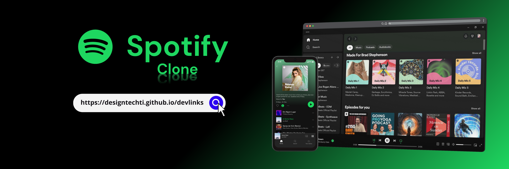
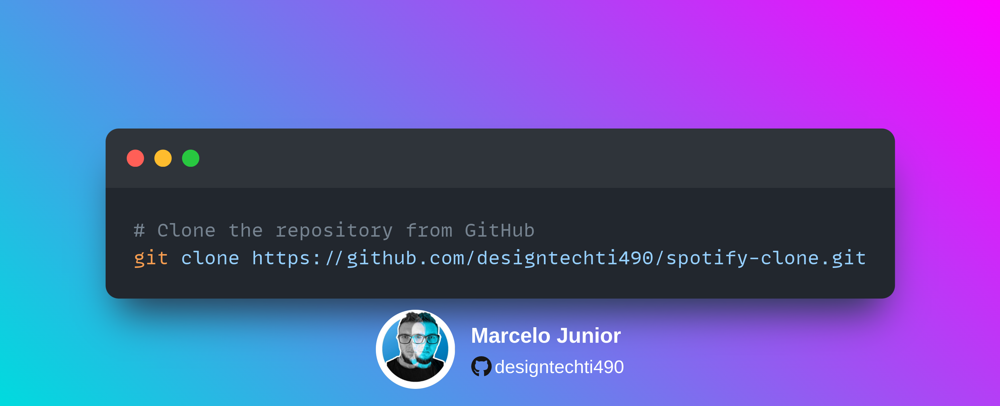
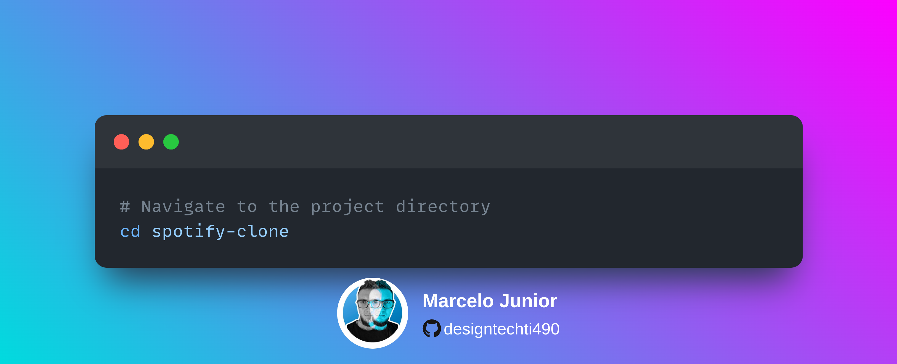
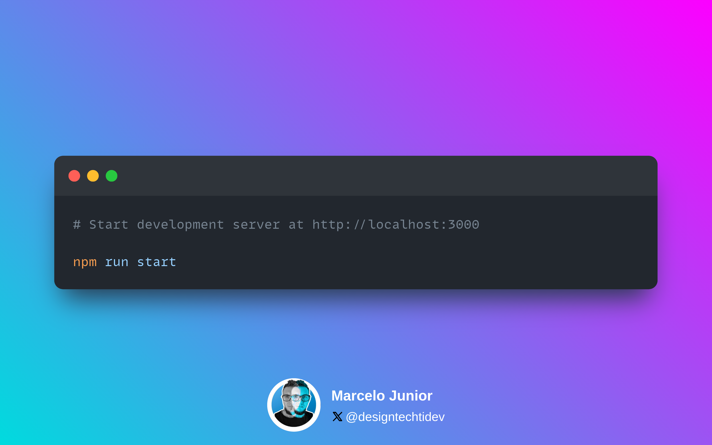
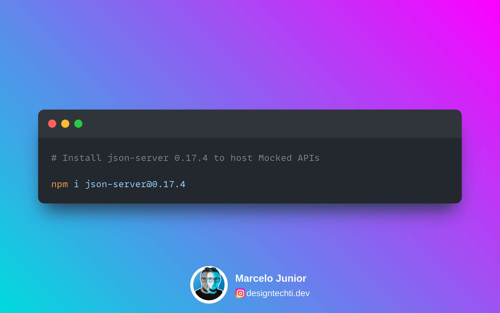
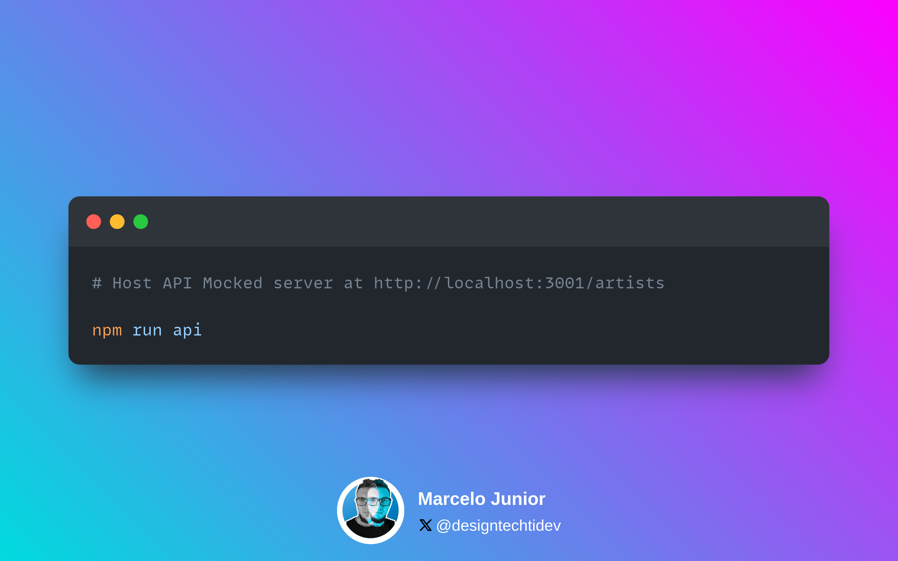

# Spotify Clone

## 🔍 Project Overview

This project is a clone of the Spotify web application. It aims to replicate the layout of Spotify pages. It was developed during the 2nd edition of Imersão Dev from Alura Courses.

## ✔️ Content

- Design inspired by Spotify
- Font Awesome icons
- Fonts from Google Fonts
- Responsive design for desktop and mobile devices
- Search Artists

## 💡 Technologies Used

&nbsp;
&nbsp;
&nbsp;
&nbsp;

## ⚡ Setup

1. Clone the repository:

  

2. Navigate to the project directory:

  

3. Install dependencies:

4. Start the development server:

  

5. Install json-server to host Mocked APIs:

  

6. Host API server with json-server:

  

## 🤝 Contributing

Contributions are welcome! Please fork the repository and submit a pull request.

## 📝 License

This project is licensed under the MIT License.

## 📲 Connect with Me

**Made with 💜 by [@designtechti490](https://github.com/designtechti490)**
